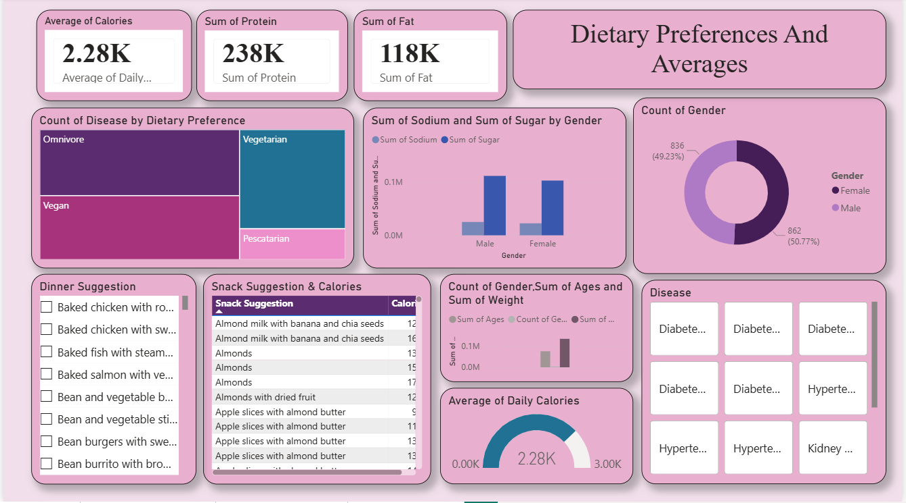
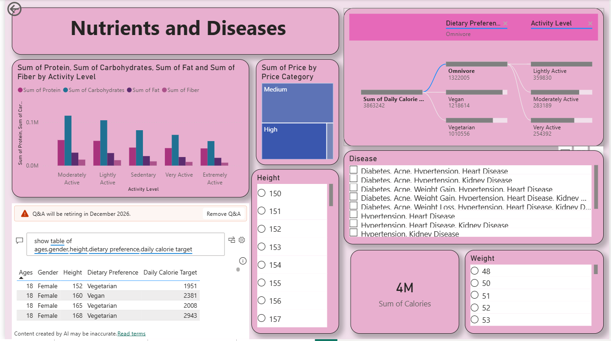
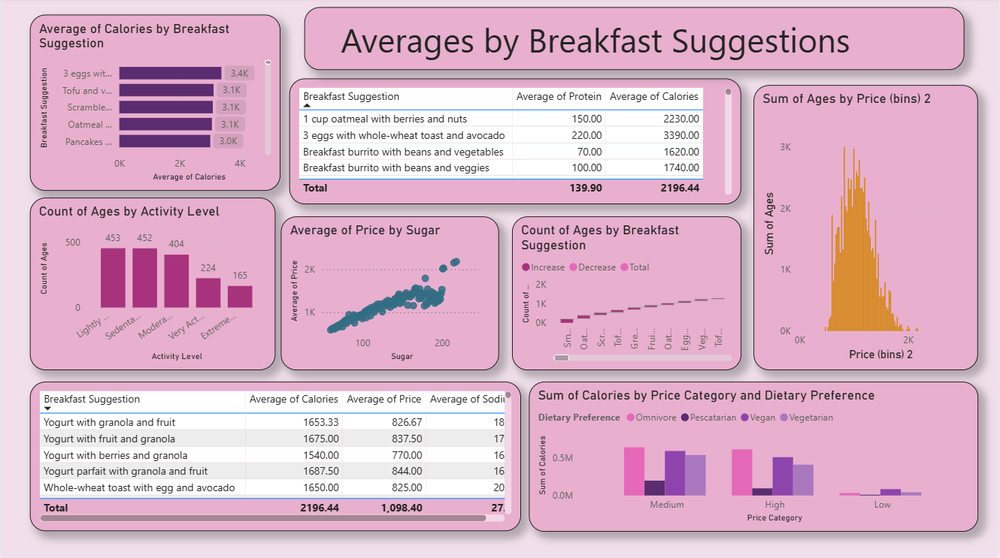
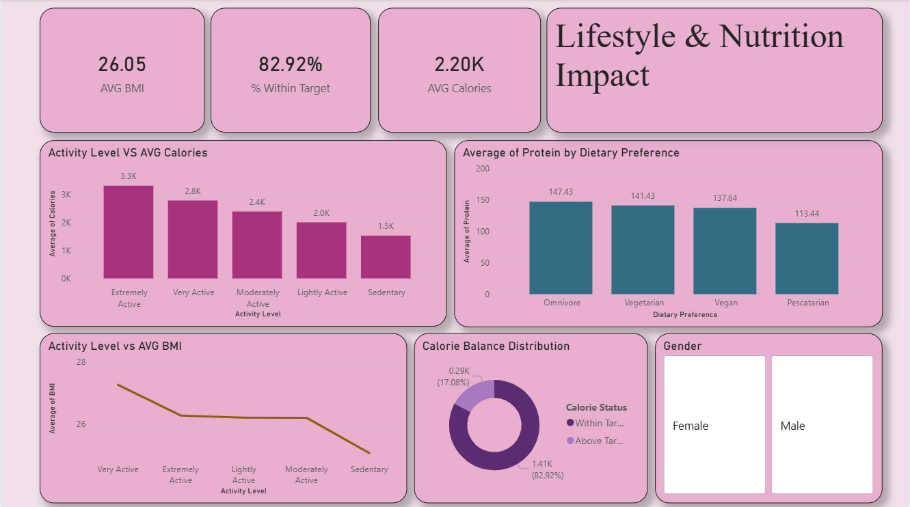

# FoodTrends-Understanding-Customer-Preferences-in-FB
## 📝 Project Overview
This Power BI project provides a comprehensive analysis of nutritional habits and lifestyle impacts based on customer data. The goal is to visualize the relationship between dietary preferences (Vegan, Omnivore, etc.), physical activity levels, and health outcomes like BMI and specific disease prevalence.

## 🎯 Objectives
* **Demographic Analysis:** Examine how gender and age influence calorie, protein, and fat consumption.
* **Health Correlation:** Map the prevalence of diseases (Diabetes, Hypertension) against dietary choices.
* **Activity Impact:** Visualize how different activity levels (Sedentary to Extremely Active) affect average BMI and calorie balance.
* **Meal Optimization:** Identify top-performing breakfast and snack suggestions based on nutritional density and price categories.

---

## 📊 Dashboard Breakdown

### 1. Dietary Preferences & Averages
* **Focus:** High-level nutrient KPIs and demographic distribution.
* **Key Insight:** Female users represent approximately 50.77% of the dataset, with average daily calorie intake hovering around 2.28K.
* 

### 2. Nutrients and Diseases
* **Focus:** Deep-dive into how lifestyle choices lead to specific health conditions.
* **Key Insight:** Using the **Decomposition Tree**, we can trace how "Omnivore" and "Vegan" preferences branch out into different activity levels and caloric targets.
*

### 3. Averages by Breakfast Suggestions
* **Focus:** Analyzing the nutritional value and pricing of the most important meal of the day.
* **Key Insight:** There is a strong linear correlation between sugar content and the average price of breakfast items, suggesting "premium" options often contain higher sugar.
* 

### 4. Lifestyle & Nutrition Impact
* **Focus:** Tracking physical fitness metrics like BMI and Calorie Balance.
* **Key Insight:** Approximately **82.92% of users are within their target calorie range**, and there is a visible decrease in average BMI as activity levels move from Sedentary to Very Active.
*

---

## 🛠 Tech Stack
* **Power BI Desktop:** Data modeling and interactive visualization.
* **DAX:** Created measures for % Within Target, Average BMI, and Nutrient Sums.
* **Power Query:** Cleaned and transformed the dataset for disease-to-diet mapping.
* **Excel/CSV datasets:** simulated from FB trend reports.

## 🎨 Design Approach
* **Theme:** Used a sophisticated **Plum & Lavender palette** for high visual engagement.
* **User Experience:** Implemented vertical and horizontal slicers (Disease, Gender, Activity) for real-time filtering.
* **Clarity:** Grouped related metrics into "cards" to avoid information overload.

## 💡 Key Learnings
* Learned to use **Decomposition Trees** to visualize complex "cause-and-effect" data paths.
* Understood how to bin numerical data (like Price) to create meaningful histograms in Power BI.
* Improved storytelling by linking lifestyle activity directly to health outcomes (BMI).

## 🚀 Future Improvements
* **Predictive Modeling:** Adding a trend line to forecast BMI changes based on increased activity.
* **Live Feed:** Integrating social media API to see if FB "Food Trends" match actual consumption data.
